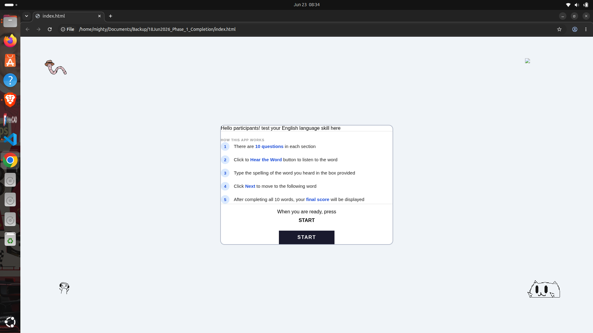
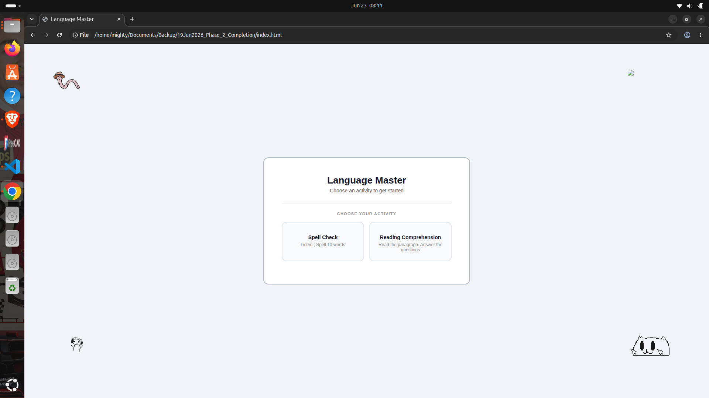
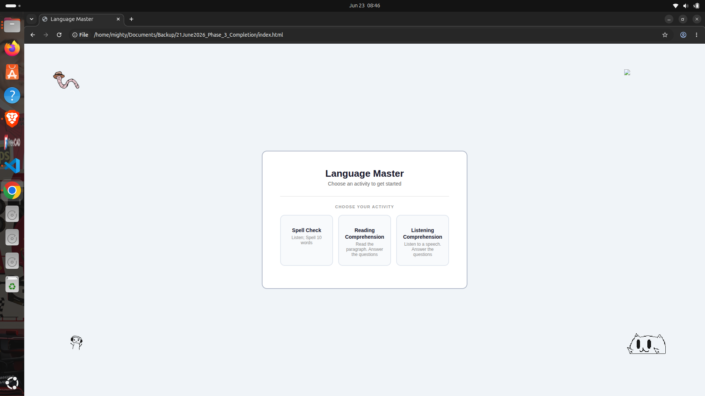
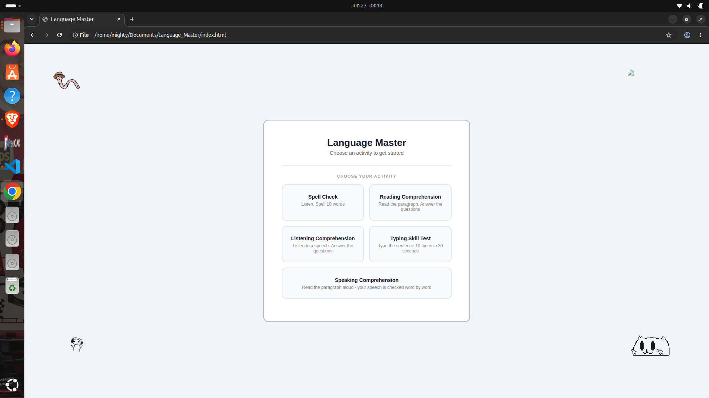

English In Action is an online program that I help run. English In Action aims to help the non-English speaking community with better fluency and confidence.

It is run by by friend Mahdiya N. (15), who lives in Afghanisthan. Despite the struggles she faces in her community, she still rises to every occasion splendidly. she's the og goat.
I've developed this app for the participants of English In Action, after we found out that many of our participants' struggled with understanding different accents. To help with this, I started building the EIA platform.
17/6/26 - I've added only the first feature, a spelling checker. It uses a standard english accent. Participants type the spelling of the word that they heard, and receive instant feedback.
They also get a final review at the end.

The doodles are hand drawn by me. i have had to struggle a lot to draw them, so they are still a WIP.

Usage: you can try it out with https://english-in-action.netlify.app/

AI usage: Yes, AI was used during development. I initially hosted the audio locally through my terminal and needed help debugging it. I also used AI when I got extremely confused with positioning the doodles and to resolve a few bugs along the way.

However, the project itself was primarily typed and assembled by me.

signing off,
erynn<3

Revision History
17-June-2026  Phase-1 of Language Master Project. 
              This phase contains Spell Check activity
20-June-2026  Phase-2 of Language Master Project
              This phase contains Reading Comprehension activity
20-June-2026  Phase-3 of Language Master Project
              This phase contains Listening Comprehension activity
21-June-2026  Phase-4 of Language Master Project
              This phase contains Typing skill test activity
22-June-2026  Phase-5 of Language Master Project
              This phase containt Speaking Comprehension activity

Note : 

1.This project code runs smoothly in Google Chrome. It uses 
WebSpeech API which Google Chrome supports seamlessly.

2. We have tested this code in Brave browser. Due to restrictions
in accessing WebsSpeech API within Brave browser, some functionality
would not work correctly

Timeline tracking Visuals :

Here we have given the visuals of my project work :

Stage : Phase-1 
Functionality : Spell Check module creation

Stage : Phase-2
Functionality : Spell Check , Reading Comprehension

Stage : Phase-3
Functionality : Spell Check, Reading Comprehension, Listening Comprehension

Stage : Phase-4
Functionality : Spell Check, Reading Comprehension, Listening Comprehension, Typing skill

Stage : Phase-5
Functionality : Spell Check, Reading Comprehension, Listening Comprehension, Typing skill, Speaking  Comprehension

